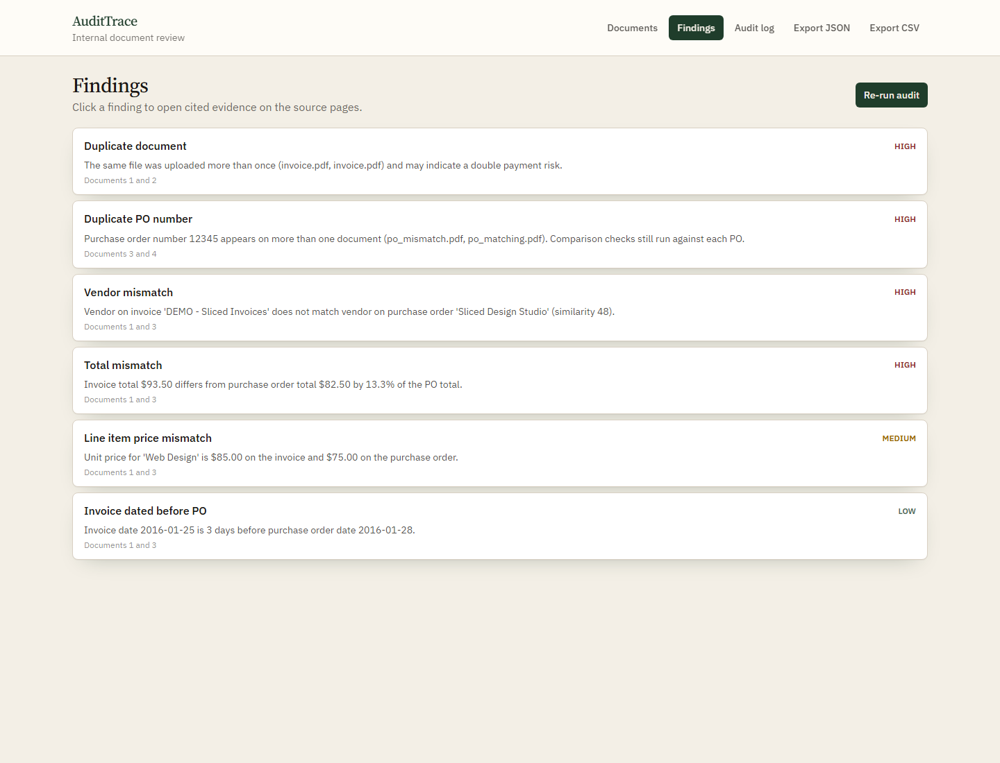
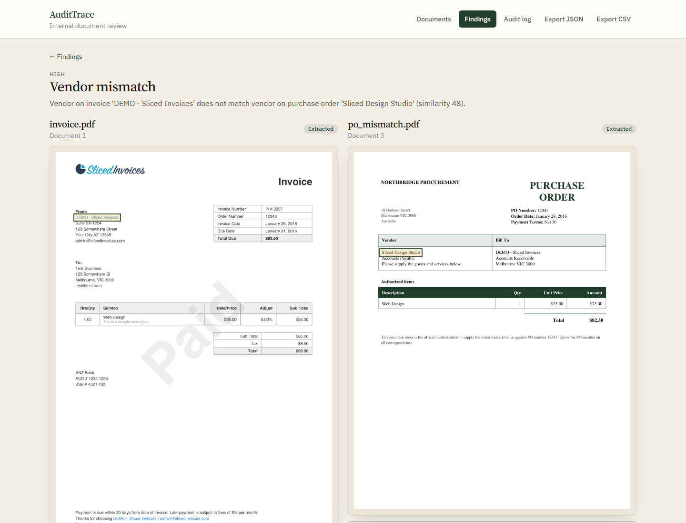
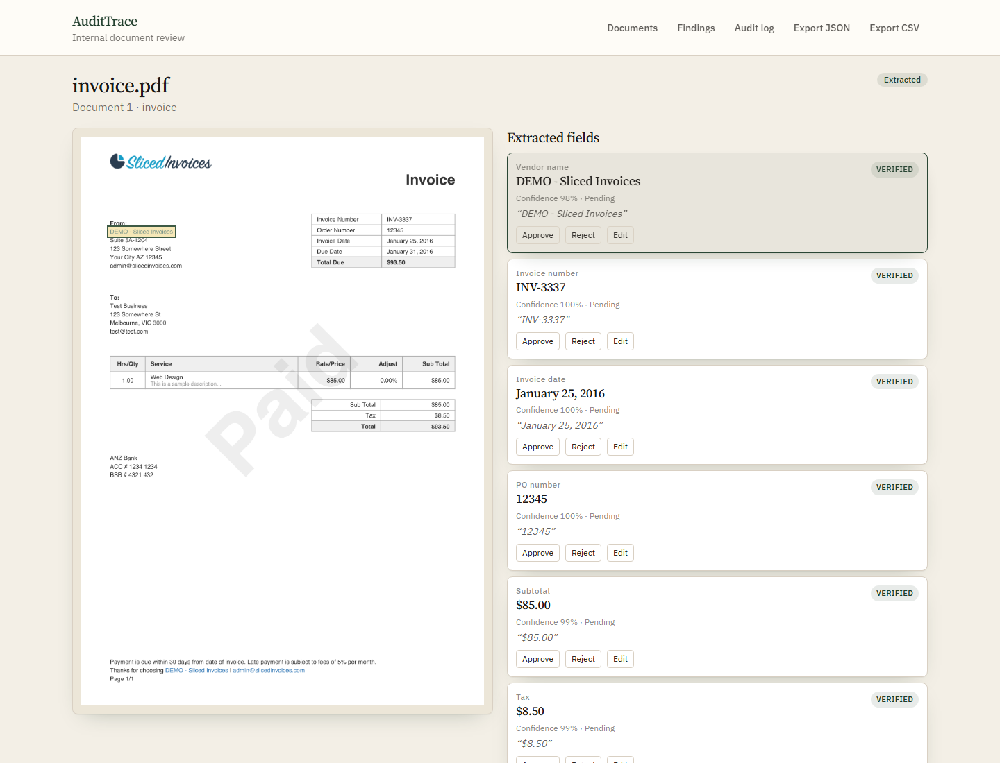
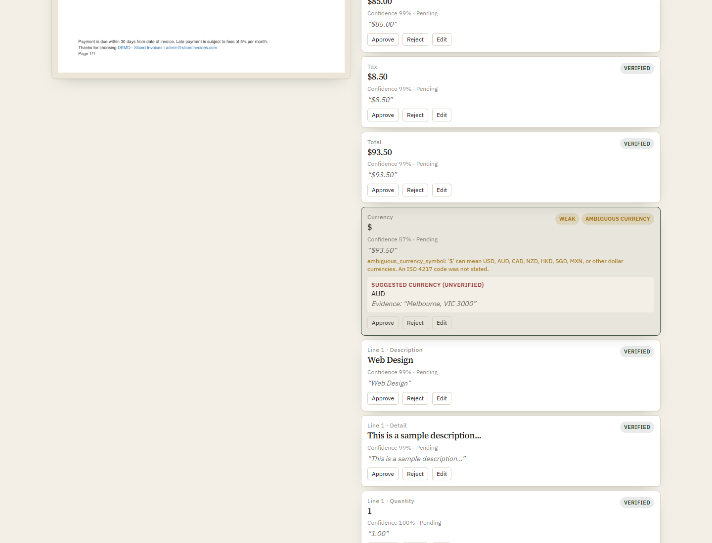
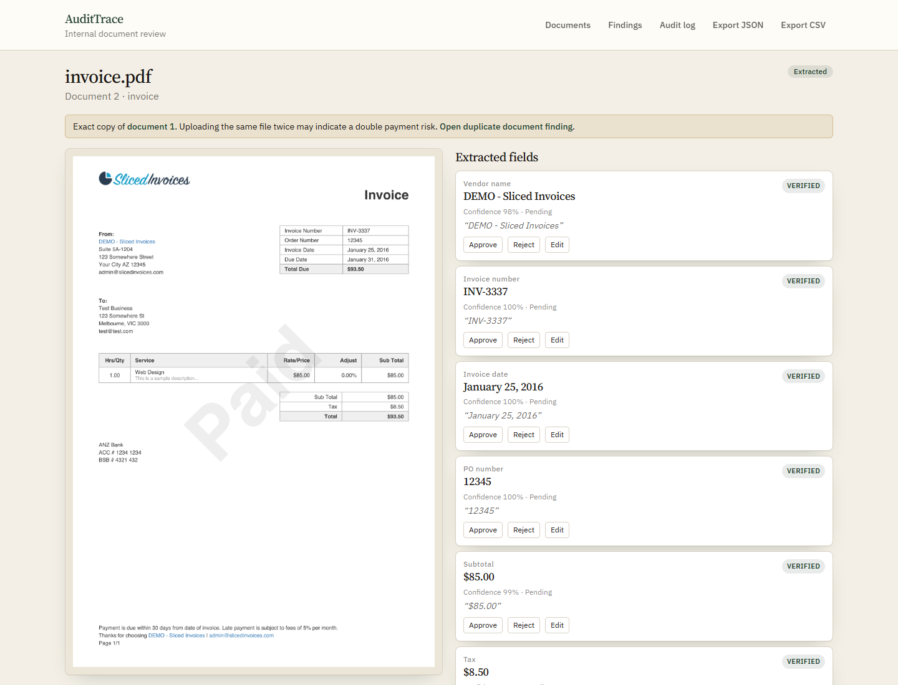
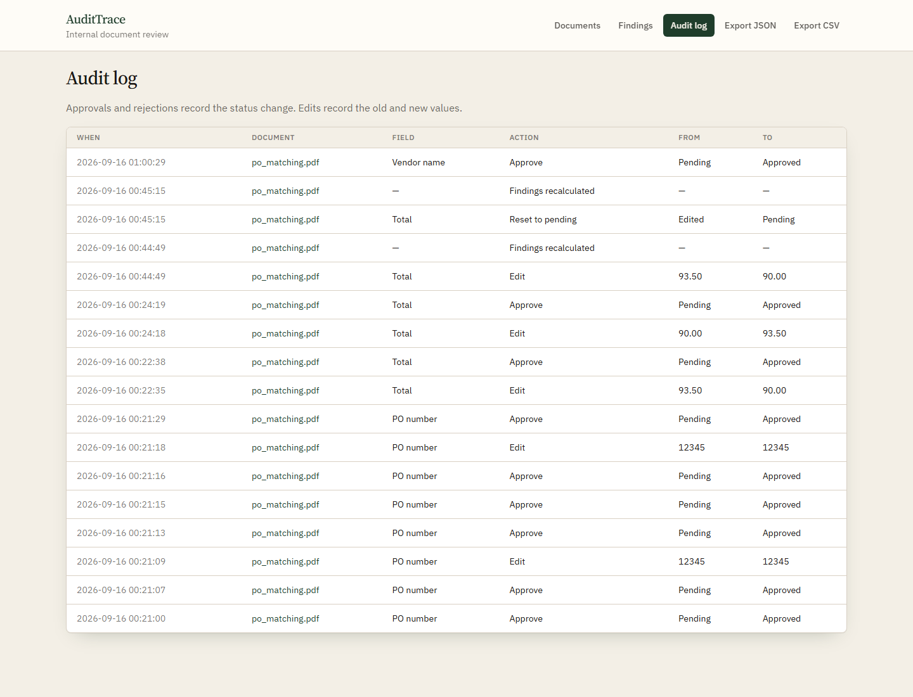
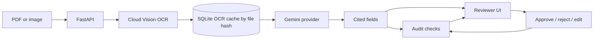

# AuditTrace

AuditTrace extracts invoice and purchase-order fields from PDFs and images, attaches each value to the OCR paragraph it came from, and runs audit checks (vendor, totals, dates, line items, duplicates) that a reviewer can confirm, edit, or reject. It exists because extraction without a source location is hard to audit: the UI highlights the cited region, verification scores the quote against the OCR text, and reviewer edits re-run findings instead of leaving a stale report.

## Screenshots

Captured from the Docker reviewer at [http://localhost:8080](http://localhost:8080) using documents already in `data/`. The capture script does not upload files or call Gemini/Vision.



Findings list, including vendor mismatch, totals, line items, and duplicates.



Vendor mismatch: both source pages with the cited vendors highlighted.



Document review: `invoice.pdf` with Vendor name selected and the cited paragraph highlighted.



Currency field: weak citation, ambiguous `$`, suggested AUD from Melbourne, VIC 3000.



Exact-copy banner on the second upload of `invoice.pdf`.



Audit log of approve, reject, edit, reset, and findings-recalculated rows.

Regenerate from the repository root with the Docker UI running. Playwright is a backend dev extra, not in `requirements.txt` (so the Docker image stays small):

```powershell
backend\.venv\Scripts\python.exe -m pip install -r backend\requirements-dev.txt
backend\.venv\Scripts\python.exe -m playwright install chromium
backend\.venv\Scripts\python.exe scripts\take_screenshots.py --base-url http://localhost:8080
```

Writes 1440px-wide PNGs to `docs/screenshots/`.

## Architecture



The API and SQLite database live in `backend/`. The React reviewer is in `frontend/` and talks to `/api`. Uploaded files, page images, and `audittrace.db` are stored under repository-root `data/` (gitignored). Evaluation uses a second database at repository-root `data/eval/eval.db` and writes `data/eval/results.md`.

## API keys

Copy `.env.example` to `.env` in the repository root. Do not commit `.env`.

1. **Gemini** — Google AI Studio, create an API key, set `GEMINI_API_KEY`. Optional: `GEMINI_MODEL` (default **`gemini-3.6-flash`**) and `GEMINI_FALLBACK_MODEL` (default `gemini-3.5-flash-lite`). The fallback is used by the API after transient retries fail. Evaluation pins one model and disables fallback. The published eval below used **`gemini-3.5-flash-lite`**, not the API default, because the Gemini free tier rate-limits `gemini-3.6-flash`.
2. **Cloud Vision** — Google Cloud project with the Vision API enabled, create an API key, set `GOOGLE_VISION_API_KEY`. The backend sends it as `X-Goog-Api-Key`, not in the URL.

The GitHub Actions workflow does not use these keys. Tests mock Vision and Gemini.

## Local setup

Requires Python 3.12, Node 22, and the two API keys.

Create a virtual environment in `backend/` and install dependencies:

```powershell
cd backend
python -m venv .venv
.\.venv\Scripts\Activate.ps1
pip install -r requirements.txt
```

Start the API from `backend/` (one process; do not start a second copy):

```powershell
uvicorn app.main:app --reload --port 8000
```

Install and run the reviewer from `frontend/`:

```powershell
cd frontend
npm install
npm run dev
```

Open [http://localhost:5173](http://localhost:5173). Vite proxies `/api` to `http://127.0.0.1:8000`. Upload a PDF on the documents page; OCR then extraction run in the background. Click a field to highlight its source paragraph.

Backend tests (from `backend/`, venv activated). **93** tests; Vision and Gemini are mocked, so API keys are not required:

```powershell
pytest
```

Frontend typecheck and build (from `frontend/`):

```powershell
npm run build
```

## Docker setup

On a machine with Docker Compose and a root `.env` file only:

```powershell
docker compose up --build
```

If port 8000 is already used by a local `uvicorn` process, stop that process first (`Ctrl+C` in its terminal). Compose maps:

- Reviewer: [http://localhost:8080](http://localhost:8080) (nginx, `/api` proxied to the backend)
- API: [http://localhost:8000](http://localhost:8000)
- Health: [http://localhost:8000/api/health](http://localhost:8000/api/health) should return `{"status":"ok"}`

`./data` is mounted into the backend at `/app/data`, so SQLite, uploads, and page images survive `docker compose down`. Eval files stay in `./data/eval/` on the host.

Useful checks:

```powershell
docker compose ps
curl http://localhost:8000/api/health
curl http://localhost:8080
```

Stop with `docker compose down`. The `data/` folder on the host is not deleted.

## Evaluation

Eval is isolated from the UI database. Both `eval.db` and `results.md` live at **repository-root** `data/eval/` (not under `backend/`), even though you run the command from `backend/`.

From `backend/` with the venv activated:

```powershell
python -m eval.run --delay 20 --model gemini-3.5-flash-lite
```

`--model` pins that Gemini model for the whole run and disables fallback. The API default `GEMINI_MODEL` is still `gemini-3.6-flash`; the published numbers below used `gemini-3.5-flash-lite` because the Gemini free tier rate-limits `gemini-3.6-flash`. Documents that still fail after retries are marked failed and skipped. Documents already extracted with a different model are reset to `ocr_complete` and re-extracted (OCR cache is reused). Re-run the same command to resume.

Rebuild the markdown report from the existing eval database (no Vision or Gemini calls):

```powershell
python -m eval.run --report-only --model gemini-3.5-flash-lite
```

The command prints the resolved path and the repository-relative path, for example `repository-root data/eval/results.md` and `repository-root data/eval/eval.db`.

On the Gemini free tier a full run is about 15–40 minutes (19 files, two Gemini calls each, plus OCR, plus `--delay`).

## Evaluation results

The API default `GEMINI_MODEL` is `gemini-3.6-flash`. This published run used `gemini-3.5-flash-lite` (no fallback) because the Gemini free tier rate-limits `gemini-3.6-flash`. Originally 9 planted findings were listed. The first report had **3** false positives; those three were side effects of planted data and were added to ground truth. A fourth expected finding (`duplicate_invoice_number` on the faded and rotated scans) was also added after those files were included in audit scoring — they were extraction-only in the original report, so that check was not one of the 3 extras. Remaining false positives: 0. False negatives: 0.

Field accuracy: most types 100%. `line_items.description` and `line_items.detail` were 17/19 (89%), both wrong on the same two documents (`inv_total_high.pdf`, `po_dup_b.pdf`). Citation verification: 200/211 (95%); the 11 weak citations are every invoice `currency` field, which is the expected badge for a bare `$`. Scan quality: faded and rotated copies of `inv_clean.pdf` were 13/13; the four field errors were on clean PDFs (185/189). All 11 invoices that use a bare `$` were flagged `ambiguous_currency_symbol`.

Pinned model: **gemini-3.5-flash-lite** (no fallback).

### Models used

| Document | Status | Model |
| --- | --- | --- |
| inv_clean.pdf | extracted | gemini-3.5-flash-lite |
| inv_clean_copy.pdf | extracted | gemini-3.5-flash-lite |
| inv_clean_faded.png | extracted | gemini-3.5-flash-lite |
| inv_clean_rotated.png | extracted | gemini-3.5-flash-lite |
| inv_date.pdf | extracted | gemini-3.5-flash-lite |
| inv_dup_a.pdf | extracted | gemini-3.5-flash-lite |
| inv_dup_b.pdf | extracted | gemini-3.5-flash-lite |
| inv_lines.pdf | extracted | gemini-3.5-flash-lite |
| inv_total_high.pdf | extracted | gemini-3.5-flash-lite |
| inv_total_med.pdf | extracted | gemini-3.5-flash-lite |
| inv_vendor.pdf | extracted | gemini-3.5-flash-lite |
| po_clean.pdf | extracted | gemini-3.5-flash-lite |
| po_date.pdf | extracted | gemini-3.5-flash-lite |
| po_dup_a.pdf | extracted | gemini-3.5-flash-lite |
| po_dup_b.pdf | extracted | gemini-3.5-flash-lite |
| po_lines.pdf | extracted | gemini-3.5-flash-lite |
| po_total_high.pdf | extracted | gemini-3.5-flash-lite |
| po_total_med.pdf | extracted | gemini-3.5-flash-lite |
| po_vendor.pdf | extracted | gemini-3.5-flash-lite |

### Field accuracy

| Field type | Correct | Total | Accuracy |
| --- | ---: | ---: | ---: |
| currency | 11 | 11 | 100% |
| invoice_date | 11 | 11 | 100% |
| invoice_number | 11 | 11 | 100% |
| line_items.amount | 19 | 19 | 100% |
| line_items.description | 17 | 19 | 89% |
| line_items.detail | 17 | 19 | 89% |
| line_items.quantity | 19 | 19 | 100% |
| line_items.unit_price | 19 | 19 | 100% |
| order_date | 8 | 8 | 100% |
| po_number | 19 | 19 | 100% |
| subtotal | 11 | 11 | 100% |
| tax | 11 | 11 | 100% |
| total | 19 | 19 | 100% |
| vendor_name | 19 | 19 | 100% |

### Field accuracy by document condition

| Condition | Correct | Total | Accuracy |
| --- | ---: | ---: | ---: |
| clean PDF | 185 | 189 | 98% |
| faded scan | 13 | 13 | 100% |
| rotated scan | 13 | 13 | 100% |

### Incorrect fields

| Document | Field | Expected | Extracted |
| --- | --- | --- | --- |
| inv_total_high.pdf | line_items[0].description | Web Design | Web Design Campaign |
| inv_total_high.pdf | line_items[0].detail | Campaign landing page | landing page |
| po_dup_b.pdf | line_items[0].description | Web Design | Web Design Campaign |
| po_dup_b.pdf | line_items[0].detail | Campaign landing page | landing page |

`line_items.description` and `line_items.detail` both missed on the same 2 documents: `inv_total_high.pdf`, `po_dup_b.pdf`. In both cases the model split the template line that combines description and detail (Web Design / Campaign landing page) into description `Web Design Campaign` and detail `landing page`.

### Unverified or weak citations

| Document | Field | Status |
| --- | --- | --- |
| inv_clean.pdf | currency | weak |
| inv_clean_copy.pdf | currency | weak |
| inv_clean_faded.png | currency | weak |
| inv_clean_rotated.png | currency | weak |
| inv_date.pdf | currency | weak |
| inv_dup_a.pdf | currency | weak |
| inv_dup_b.pdf | currency | weak |
| inv_lines.pdf | currency | weak |
| inv_total_high.pdf | currency | weak |
| inv_total_med.pdf | currency | weak |
| inv_vendor.pdf | currency | weak |

Citation verification rate: **200/211** (95%).

### Expected findings

| Check | Documents | Severity | Caught |
| --- | --- | --- | --- |
| vendor_mismatch | inv_vendor.pdf, po_vendor.pdf | high | yes |
| total_mismatch | inv_total_high.pdf, po_total_high.pdf | high | yes |
| total_mismatch | inv_total_med.pdf, po_total_med.pdf | medium | yes |
| line_item_price_mismatch | inv_lines.pdf, po_lines.pdf | medium | yes |
| line_item_quantity_mismatch | inv_lines.pdf, po_lines.pdf | medium | yes |
| invoice_dated_before_po | inv_date.pdf, po_date.pdf | medium | yes |
| duplicate_invoice_number | inv_dup_a.pdf, inv_dup_b.pdf | high | yes |
| duplicate_po_number | po_dup_a.pdf, po_dup_b.pdf | high | yes |
| duplicate_document | inv_clean.pdf, inv_clean_copy.pdf | high | yes |
| total_mismatch | inv_lines.pdf, po_lines.pdf | high | yes (correct, added to ground truth) |
| line_item_price_mismatch | inv_total_high.pdf, po_total_high.pdf | medium | yes (correct, added to ground truth) |
| line_item_price_mismatch | inv_total_med.pdf, po_total_med.pdf | medium | yes (correct, added to ground truth) |
| duplicate_invoice_number | inv_clean_faded.png, inv_clean_rotated.png | high | yes (correct, added to ground truth) |

Originally planted: **9**. Original extras (false positives): **3**. Findings added to ground truth: **4**. Expected now: **13**. False positives remaining: **0**. False negatives: **0**.

### Findings added to ground truth

| Check | Documents | Severity | Original extra | Classification |
| --- | --- | --- | --- | --- |
| total_mismatch | inv_lines.pdf, po_lines.pdf | high | yes | Correct side effect of the planted quantity and unit-price change: invoice total $110.00 vs PO total $40.00. |
| line_item_price_mismatch | inv_total_high.pdf, po_total_high.pdf | medium | yes | Correct side effect of the planted high total mismatch: the PO unit price was lowered to $70.00, so the line-item price check also fires. |
| line_item_price_mismatch | inv_total_med.pdf, po_total_med.pdf | medium | yes | Correct side effect of the planted medium total mismatch: the PO unit price was lowered to $82.00, so the line-item price check also fires. |
| duplicate_invoice_number | inv_clean_faded.png, inv_clean_rotated.png | high | no | Correct behaviour: the faded and rotated scans are copies of inv_clean.pdf and share invoice number INV-1001. inv_clean.pdf itself is excluded from this check because it is a byte-for-byte duplicate of inv_clean_copy.pdf. |

### Remaining false positives

None. The original evaluation reported **3** extras; all of them were side effects of planted data and were added to ground truth. A further **1** expected finding was also added (`duplicate_invoice_number` on `inv_clean_faded.png`, `inv_clean_rotated.png`) after degraded scans were included in audit scoring. Those files were extraction-only in the original run, so that finding was not among the 3 false positives.

### Ambiguous currency flags

Every invoice in this corpus uses a bare `$` with no ISO code. **11/11** were flagged `ambiguous_currency_symbol`.

### Limitations

- Documents are synthetic PDFs and PNG scans from a single template generator, not real vendor invoices.
- Sample size is 19 documents (11 invoices including two degraded scans, 8 purchase orders).
- Extraction used `gemini-3.5-flash-lite` (not the API default `GEMINI_MODEL=gemini-3.6-flash`) because the Gemini free tier rate-limits `gemini-3.6-flash`.
- This is a smoke test that the checks fire on planted issues, not a benchmark of production accuracy.

## Design decisions

- **Traceable citations, verified in code.** Gemini returns paragraph IDs and a supporting quote. The backend looks up those OCR paragraphs, fuzzy-matches the quote, and sets `verified` / `weak` / `unverified`. Reviewers click a field to highlight the source region on the page image.
- **OCR caching by file hash.** Vision results are stored per SHA-256 of the file bytes. Re-uploads of the same bytes reuse the cache and skip Vision.
- **Duplicate detection.** The same hash is recorded as `duplicate_of_document_id` and can raise `duplicate_document`. Separate files that share an invoice or PO number raise `duplicate_invoice_number` / `duplicate_po_number`. Byte-identical copies are excluded from the invoice-number duplicate check so the hash duplicate is not double-counted.
- **Severity calibration.** Total mismatches use a percent-of-PO threshold (`TOTAL_MISMATCH_HIGH_PERCENT`, default 5). Invoice-before-PO uses a day gap (`INVOICE_BEFORE_PO_LOW_DAYS`, default 7).
- **Swappable LLM provider.** Extraction talks to `LLMProvider`. `GeminiProvider` is the implementation; tests inject fakes. `get_llm_provider()` is the default factory.
- **Error classification.** 429 and 503/500/timeouts are retried with backoff. Billing and permission errors fail fast and are not retried. Evaluation `--model` sets `fallback_model=""` so a 429 does not silently continue on Flash Lite.
- **API key redaction in logs.** Vision uses the `X-Goog-Api-Key` header. `httpx` / `httpcore` log at WARNING. A logging filter redacts `AIza` + 35 characters from log records.
- **Reviewer edits recompute findings.** Approve, reject, edit, and reset write an audit-log row. Edits keep the original AI value. After a review action the auditor runs again so findings match the current field values.
